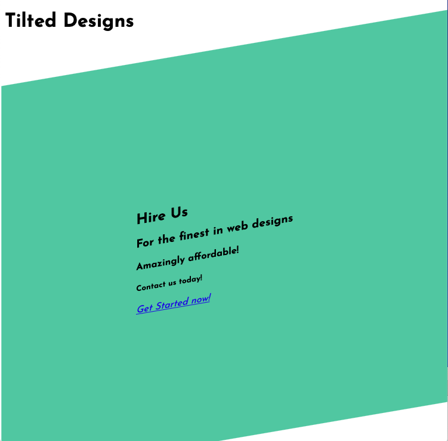

# Transform activity

## Getting Started

- open `index.html` in your text editor and the browser
- open `activity.css` in your text editor

## Using transform

Add a transform rule to the `main` element in `activity.css`

so that you can make the page look like

**NOTE** - browser width and height will alter the appearance of this design. Try to make it look good around a medium browser width. Don't stress about making this work for every browser size. Close enough is good enough!
